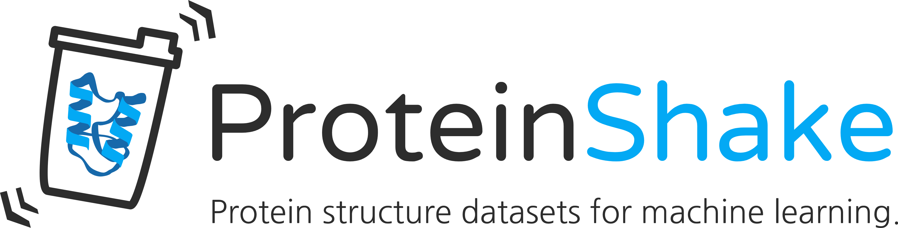

<p align="center">



</p>


[](https://pypi.org/project/proteinshake/)
[](https://proteinshake.readthedocs.io/en/latest/?badge=latest)
[](https://pypi.org/project/proteinshake/)

<p align="center">&nbsp;&nbsp;&nbsp;&nbsp;&nbsp;
<a href="">Quickstart</a>&nbsp;&nbsp;&nbsp;&nbsp;&nbsp;
<a href="">Documentation</a>&nbsp;&nbsp;&nbsp;&nbsp;&nbsp;
<a href="">Paper</a>&nbsp;&nbsp;&nbsp;&nbsp;&nbsp;
<a href="">Contribute</a>&nbsp;&nbsp;&nbsp;&nbsp;&nbsp;
<a href="">Leaderboard</a>
</p>

ProteinShake provides one-liner imports of large scale, preprocessed protein structure datasets for various model types and frameworks.


### Installation
```
pip install proteinshake
```

### Demo
```python
>>> from proteinshake.datasets import AlphaFoldDataset

>>> data = AlphaFoldDataset(organism='escherichia_coli').to_graph(k=5).pyg()
>>> graph, protein_dict = data[0]
>>> graph
Data(x=[196], edge_index=[2, 0], edge_attr=[0, 1])
>>> protein_dict['protein']['ID']
'P0A9H5'
>>> protein_dict['protein']['sequence']
'MSDERYQQRQQRVKEKVDARVAQAQDERGIIIVFTGNGK...'
```


### Legal Note

<!---
We make our code available under the [BSD-3 License](https://github.com/BorgwardtLab/proteinshake/blob/main/LICENSE). The datasets are distributed under [CC-BY-4.0](https://creativecommons.org/licenses/by/4.0/).
-->

We obtained and modified data from the following sources:

The AlphaFold protein structures were downloaded from the [AlphaFold Structure Database](https://alphafold.ebi.ac.uk/), licensed under [CC-BY-4.0](https://creativecommons.org/licenses/by/4.0/).

The RCSB protein structures were downloaded from [RCSB](https://www.rcsb.org/), licensed under [CC0 1.0](https://creativecommons.org/publicdomain/zero/1.0/).
