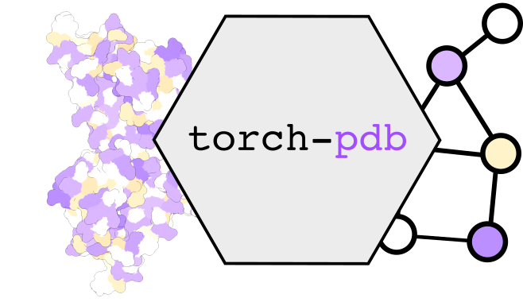

[pypi-img]: https://img.shields.io/pypi/v/torch-pdb

[pypi-url]: https://pypi.org/project/torch-pdb


[](https://torch-pdb.readthedocs.io/en/latest/?badge=latest)
[![PyPI version][pypi-img]][pypi-url]
[](https://raw.githubusercontent.com/BorgwardtLab/torch-pdb/main/LICENSE)


# `torch-pdb`: torch-geometric datasets built from the PDB



This is a collection of torch-geometric datasets built from [PDB](https://www.rcsb.org/).
After installing, datasets can be passed directly to torch loaders for model training.


| name                                           |   num_proteins |   avg size (# residues) | property                                | values      | type                      |
|:-----------------------------------------------|---------------:|------------------------:|:----------------------------------------|:------------|:--------------------------|
| RCSBDataset                                    |          21989 |                 56.8898 | -                                     | -         | -                       |
| PfamDataset                                    |          18696 |                 59.4297 | Protein Family (Pfam)                   | 5215 (root) | Categorical, Hierarchical |
| GODataset                                      |          19267 |                 58.8485 | Gene Ontology (GO)                      | 101 (root)  | Categorical, Hierarchical |
| ECDataset                                      |           8150 |                 74.9618 | Enzyme Classification (`EC`)            | 2173        | Categorical               |
| PDBBindRefined                                 |           4642 |                108.806  | Small Mol. Binding Site (residue-level) | 2           | Binary                    |
| TMScoreBenchmark                               |            200 |                 49.458  | TM Score                                | [0-1]       | Real-valued, Pairwise     |
| AlphaFoldDataset_arabidopsis_thaliana          |          27434 |                 66.1312 | -                                     | -         | -                       |
| AlphaFoldDataset_caenorhabditis_elegans        |          19694 |                 65.0678 | -                                     | -         | -                       |
| AlphaFoldDataset_candida_albicans              |           5974 |                 62.782  | -                                     | -         | -                       |
| AlphaFoldDataset_danio_rerio                   |          24664 |                 75.2797 | -                                     | -         | -                       |
| AlphaFoldDataset_dictyostelium_discoideum      |          12622 |                 85.9275 | -                                     | -         | -                       |
| AlphaFoldDataset_drosophila_melanogaster       |          13458 |                 81.2947 | -                                     | -         | -                       |
| AlphaFoldDataset_escherichia_coli              |           4363 |                 51.5408 | -                                     | -         | -                       |
| AlphaFoldDataset_glycine_max                   |          55799 |                 58.0664 | -                                     | -         | -                       |
| AlphaFoldDataset_homo_sapiens                  |          23391 |                105.457  | -                                     | -         | -                       |
| AlphaFoldDataset_methanocaldococcus_jannaschii |           1773 |                 46.7467 | -                                     | -         | -                       |
| AlphaFoldDataset_mus_musculus                  |          21615 |                 83.0434 | -                                     | -         | -                       |
| AlphaFoldDataset_oryza_sativa                  |          43649 |                 44.1931 | -                                     | -         | -                       |
| AlphaFoldDataset_rattus_norvegicus             |          21272 |                 78.1547 | -                                     | -         | -                       |
| AlphaFoldDataset_saccharomyces_cerevisiae      |           6040 |                 80.0745 | -                                     | -         | -                       |
| AlphaFoldDataset_schizosaccharomyces_pombe     |           5128 |                 76.2427 | -                                     | -         | -                       |
| AlphaFoldDataset_zea_mays                      |          39299 |                 46.1618 | -                                     | -         | -                       |


## Installation


```
$ pip install torch-pdb
```

Note: ensure that you are using the correct versions of `torch-[scatter,sparse]` according to your hardware and cuda version. See [this](https://pytorch-geometric.readthedocs.io/en/latest/notes/installation.html#installation-via-pip-wheels) page for more info.


### From source

```
$ git clone https://github.com/BorgwardtLab/torch-pdb
$ cd torch-pdb
$ pip install .
```

## Quickstart


```python
>>> from pdb_pyg.datasets import PDBBindRefined

>>> dataset = PDBBindRefined(name='pdbbind')
>>> d[0]
Data(edge_index=[2, 512], chain_id=[257], residue_idx=[257], residue=[257], residue_name=[257], residue_number=[257], residue_position=[257], coord=[257, 3], aa_idx=[257, 553], bond_type=[512], num_nodes=257, datapath='/tmp/var/test/raw/6ugp/6ugp_protein.pdb', name='6ugp')
```

## Datasets

This is a summary of available datasets.


## Graph Building

You can customize the way graphs are built grom protein 3D structures with the following arguments to the dataset constructors:


*  `node_type (str)`: Currently only `residue` is supported.
*  `neighbor_type (str)`: We support `knn` and `radius`
*  `knn (int)`: Number of nearest neighbor residues to connect with an edge.


```python
from pdb_pyg.datasets import PDBBindRefined

dataset = PDBBindRefined(name='pdbbind', node_type='residue')
```
